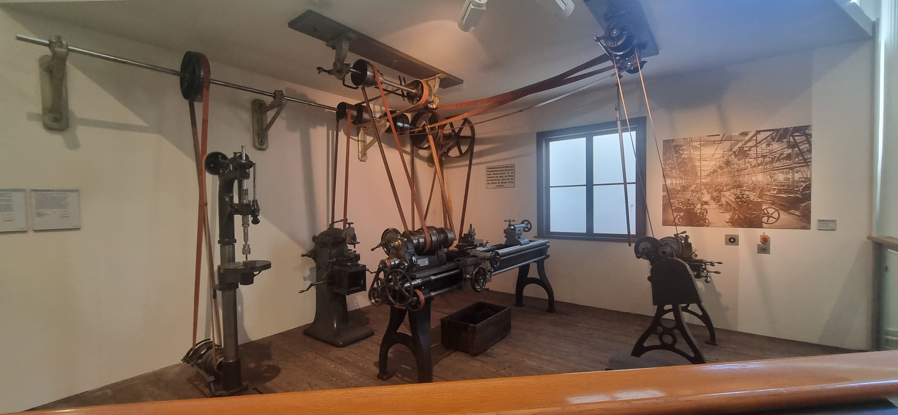
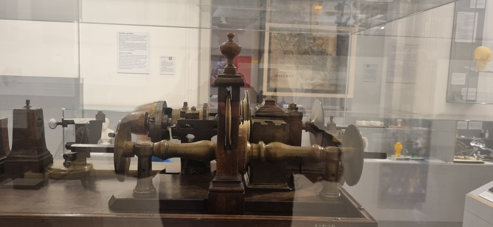
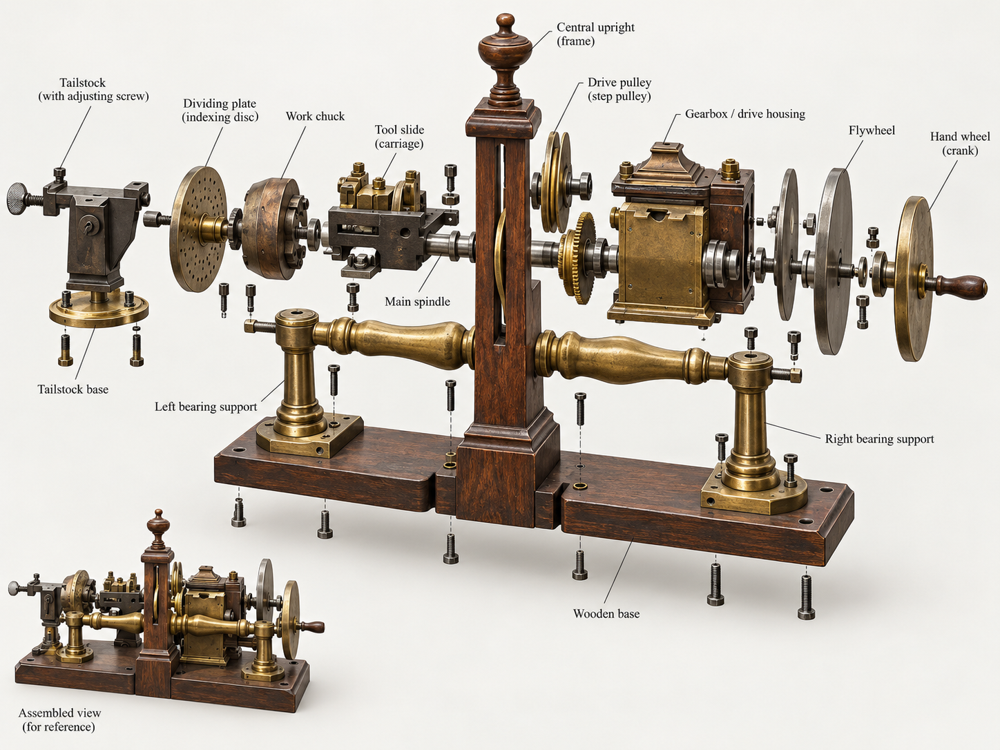
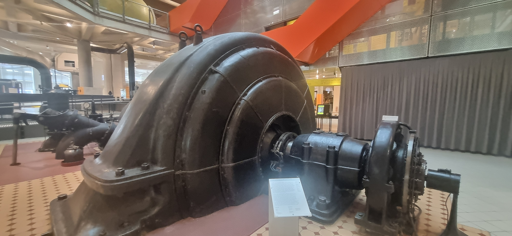
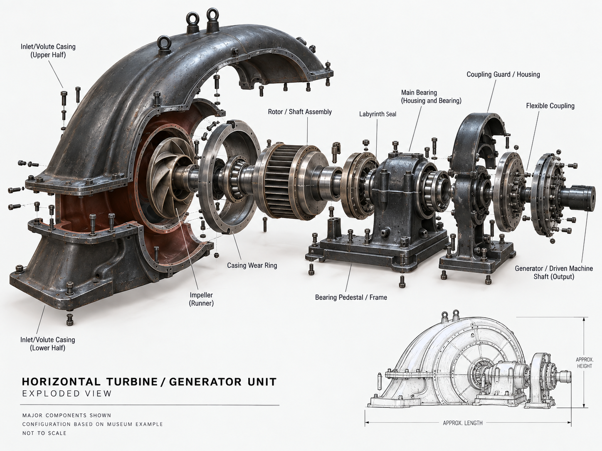

# הביקור במוזיאון הטכני

הביקור ב[[Technisches-Museum-Wien|מוזיאון הטכני של וינה]] התרכז במכונות, תחבורה, כלי עבודה ותמסורת. בסיכומי השיחות הוא משויך ככל הנראה ל־6 בספטמבר; שאלות שנמשכו ב־8 בספטמבר אינן מעידות שהיינו שם פעמיים. כאן נשמרים מוקדי ההתבוננות, בלי לשרטט סדר אולמות שלא תועד.

## לראות מעבר לשם המכונה

באולם המכונות התעכבנו על צירים ורצועות. השאלה לא הייתה רק איזו מכונה זו, אלא איך התנועה מגיעה אליה. בתיעוד השיחה מופיע גם תיקון מפורש של תיאור התמונה: יש לתת מקום לתמסורת הנראית, ולא לתאר כל מוצג כאילו הוא יחידה עצמאית.

בתמסורת רצועה, ברמה העקרונית, התנועה עוברת בין גלגלות באמצעות רצועה הנעה במגע עמן. כדי להסביר מתקן מסוים צריך לזהות מה מניע את הגלגלת הראשונה, לאיזה ציר מחוברת השנייה וכיצד נמתחת הרצועה. אצלנו נשמרת ההתבוננות בצירים וברצועות; מקור הכוח וחיבורי המערכת המסוימת עדיין דורשים צילום שלם ושלט. אין להסיק שמנוע קיטור מסוים הפעיל את כל האולם רק מפני שהדבר מוכר מבתי מלאכה היסטוריים.

*תמסורת הרצועות כפי שנראתה בתצוגה; התצלום אינו מזהה את מקור הכוח או קובע איזו מכונה הניעה כל רצועה.*

## המחרטה שיוחסה לצאר ניקולאי הראשון והמחשבה על מיכאל

אחד המוצגים המשמעותיים היה מחרטה שהוצגה בשיחה כמחרטת הצאר ניקולאי הראשון. בתמלול השלט שבמסמך העבודה מופיעים השנים 1825 עד 1855 ומספר האוסף INC 11020. אלה פרטי זיהוי מן התיעוד, שעדיין דורשים התאמה לרשומת אוסף קריאה ולצילום השלט. אין להשתמש בטווח הזה כשנת הייצור, ואין להציג שימוש אישי של הצאר כעובדה מוכחת.

בצד ההיסטורי עומדת השאלה מדוע חפץ של מלאכה נמצא בהקשר מלכותי. חריטה יכולה להיות עבודה לפרנסה, וגם עיסוק של אדם בעל זמן, ציוד ויכולת להזמין כלי מורכב. במקרה שלנו, משמעות המוצג לא נשענה רק על בעלותו המיוחסת. הוא העלה מחשבה על מיכאל, חמו של המטייל, שעבד שנים רבות בחריטה ובעיבוד מתכת. מאחורי המכונה ניצב מקצוע מוכר מן המשפחה.

*התצלום מתעד את המוצג שעליו נסבה השיחה; הזיהוי, הייחוס והפרטים הטכניים עדיין כפופים להסתייגויות שבעמוד.*

*תרשים Exploded View אילוסטרטיבי, שנוצר על בסיס התצלום. החלקים הפנימיים המוצגים הם המחשה טכנית ואינם שחזור מוזיאלי מאומת.*

ההבחנה בחומר חשובה: המוצג נדון כמחרטה לחריטת עץ או לחריטה אמנותית, ואין להפוך אותו למחרטת מתכת בשל מקצועו של מיכאל. בלי תווית מאומתת ותיעוד מלא, גם סוגי הפעולות, אופן ההנעה ואביזרי החיתוך יישארו פתוחים. החיבור האישי מוצק יותר מן הפרטים הטכניים שטרם הוכרעו, ואין צורך להוסיף להם ודאות כדי לשמר אותו.

## תחבורה, סדנה וידע מקצועי

המעבר בין כלי תחבורה למכונות עבודה מחבר שתי שאלות: איך מייצרים דבר, ואיך משתמשים בו בתוך מערכת גדולה. סיכומי הביקור תומכים בנוכחות באזורים האלה, אך אינם מאפשרים לרשום כל דגם או יצרן. לכן נקודת המוקד נשארת ההסתכלות: צורת החיבור, רכיב שממיר תנועה, המקום שבו האדם מכוון את הכלי.

*מבט על צורתה החיצונית של המכונה ועל החיבורים הגלויים; התצלום לבדו אינו משמש לזיהוי סוגה או פעולתה.*

*Exploded View אילוסטרטיבי של המכונה המצולמת. המבנה הפנימי המוצג הוא המחשה טכנית משוערת ואינו תיעוד מאומת של מנגנון המוצג במוזיאון.*

זו גם דרך לקרוא מחדש את [[Vienna-by-Public-Transport|הנסיעות בווינה]]. בחוץ השתמשנו במערכת; במוזיאון עצרנו ליד חלקים מן העולם הטכנולוגי שמאפשר מערכות כאלה. ב[[KHM-Objects-and-Mechanics|ארון האוטומטים של KHM]] הופיעה שאלה קרובה בחפץ שמטרתו אחרת לגמרי.

## מקורות וגבולות הזיהוי

- סיכומי שיחות הביקור ותמלול השלט במיפוי Pass 1, לרבות התיקון בעניין הרצועות והקשר למיכאל.
- [האוסף המקוון של המוזיאון הטכני](https://www.technischesmuseum.at/museum/online-collection), נקודת מוצא להמשך אימות המחרטה; אינו מובא כאישור לרשומה המסוימת.
- פרטי ההנעה, המספר הקטלוגי ותאריך הביקור מרוכזים ב[[Verification-Queue|תור האימות]].
