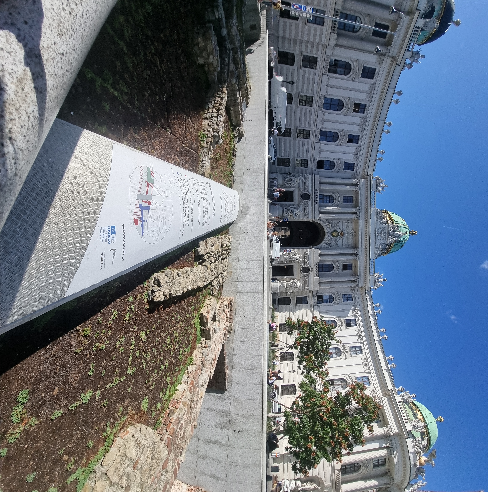

# מסלול וינה הקיסרית

## היום שלנו, 1 בספטמבר 2026

התחלנו ב[[Michaelerplatz|מיכאלרפלאץ]], המשכנו אל [[Hofburg|הופבורג]], [[Sisi-Museum|מוזיאון סיסי]] ו[[Imperial-Apartments|הדירות הקיסריות]], ובהמשך אל [[Heldenplatz|הלדנפלאץ]]. זהו הרצף שעולה מסיכום היום. הגנים והאגפים הנוספים בתכנון המקורי אינם מתווספים משום כך לרשימת הביצוע.

## שכבות בכיכר אחת

במיכאלרפלאץ התבוננו בחזית הארמון ובשרידים הארכאולוגיים שמתחת למפלס הרחוב. שתי התמונות התקיימו באותו מבט: עיר קיסרית שמציגה חזית מפוארת, ועבר קדום יותר שנחשף לפניה. בשיחה עלה גם הלוסהאוס, הקשור ל[[Adolf-Loos|אדולף לוס]], וההבדל בין שפות אדריכליות משני צדי הכיכר.

## מחצר שלטון אל חפצים של אדם

בפנים עברנו מסיפור החצר אל דמותה של סיסי ואל סביבת החיים של הזוג הקיסרי. ערכת הסכו״ם לנסיעות, מתקני האימון והאמבטיה היו מוקדים בתיעוד. חפץ קטן יכול להוסיף לסיפור מה שהאולם הגדול אינו נותן: איך נראתה שגרה, מה לוקחים לדרך ואיך הגוף עצמו נכנס לסדר היום.

העמודים הנפרדים שומרים על הבדל בין המוזיאון, העוסק בדמות ובדימוי שלה, לבין הדירות, שבהן קוראים את החדרים ואת השימושים. התבוננות בחפץ אישי אינה מספיקה לאבחן את בעליו; היא כן נותנת סיבה להכיר את [[Empress-Elisabeth-of-Austria|אליזבת]] מעבר לאגדה הרומנטית.

## שוב בחוץ, בהלדנפלאץ

הכיכר והפסלים הרכובים החזירו את המבט לקנה המידה הציבורי. אחרי חדרי המגורים, המרחב הפתוח מדגיש כיצד שלטון מציג את עצמו גם למי שאינו נכנס לארמון. ההעמקה בסיפור הכיכר ובזיכרון המאה ה־20 נמצאת ב[[Heldenplatz|עמוד המקום]].

## השעונים שבחלון

במהלך היום עצרנו גם מול שעוני ברגה (Breguet). בסיכום נזכרים שעון בעל גוון ירוק ומנגנון שנראה בחזית, ולצדו שעון כחול בעל עיטור עשיר. העניין היה בחיבור בין מכניקה לתכשיט ובין חפץ שימושי לתצוגת מלאכה.

אין כאן דגם או מחיר מאומתים, וגם ההשוואה שנעשתה בשיחה לאוסף בירושלים אינה משמשת עובדה היסטורית. המבט הזה ממשיך מאוחר יותר אל [[Schoenbrunn-Palace-Clocks|שעוני שנברון]] ו[[KHM-Objects-and-Mechanics|ארון האוטומטים]].

<!-- image-placeholder:
subject=השעונים הירוק והכחול שצולמו בחלון הראווה
context=שעוני ברגה במהלך יום וינה הקיסרית
placement=לאחר תיאור ההתבוננות; ללא שם דגם או מחיר
priority=HIGH
suggested_count=2
-->

## מקור הביקור

סיכום וינה הקיסרית מ־1 בספטמבר 2026. מקורות הרקע ההיסטוריים נמצאים בעמודי התחנות; זיהויי השעונים נשמרים ב[[Verification-Queue|תור האימות]].

## התכנון המקורי

הרשימה הבאה נשמרה מהתכנון שלפני הנסיעה; היא אינה רשימת תחנות שבוצעו.

המפה בעמוד מבוססת על תכנון זה. היא אינה תיעוד GPS של ההליכה בפועל, וסימון תחנה בה אינו מעיד שביקרנו בה.

### קצב מומלץ

מסלול של חצי יום עד יום רגוע. אין צורך להעמיס מוזיאון נוסף רק מפני שהוא נמצא במרחק שבע דקות.

### המסלול

1. [[Michaelerplatz|כיכר מיכאלר (Michaelerplatz)]]
2. [[Hofburg|הופבורג (Hofburg)]]
3. [[Sisi-Museum|מוזיאון סיסי (Sisi Museum)]]
4. [[Imperial-Apartments|הדירות הקיסריות (Kaiserappartements)]]
5. [[Heldenplatz|כיכר הגיבורים (Heldenplatz)]]
6. [[Neue-Burg|נוייה בורג (Neue Burg)]] מבחוץ
7. [[Volksgarten|פולקסגארטן (Volksgarten)]] למנוחה

### אם יש פחות כוח

Hofburg + Sisi Museum + Heldenplatz. זה מספיק. האימפריה שרדה מאות שנים; היא תשרוד גם אם לא ראינו כל אגף.

## מקורות

סיכום וינה האימפריאלית מ־1 בספטמבר 2026; ההעמקות ומקורות הרקע מקושרים בעמודי [[Michaelerplatz|מיכאלרפלאץ]], [[Hofburg|הופבורג]], [[Sisi-Museum|סיסי]] ו[[Imperial-Apartments|הדירות]].
