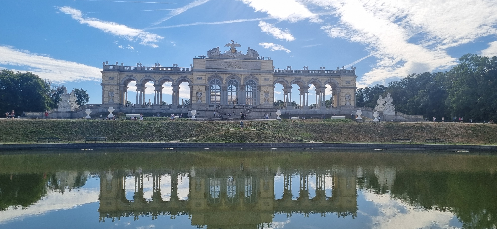

# מסלול שנברון

## היום שלנו, 7 בספטמבר 2026

היום בשנברון התחיל בחצר הכבוד (Ehrenhof). לפני הכניסה עצרנו ליד החזית, המזרקות ופנסי המתכת. הסימטריה והאורך נראו כבר מן החצר, אבל דווקא פרטי המלאכה הכינו את המבט למה שהגיע בפנים: כאן גם חפץ שימושי משתתף בעיצוב הכולל.

## בתוך הארמון

בחדרי [[Schoenbrunn-Palace|הארמון]] התעכבנו על סביבת העבודה של פרנץ יוזף, מפות וריהוט, ובהמשך על אולמות ייצוג ועל הגלריה הגדולה. המעבר ביניהם המחיש הבדל בין מרחב עבודה לבין מרחב שנועד לאורחים ולטקס. הביקור כלל גם את חדר נפוליאון, וחפצים ותמונות הקשורים למשפחה הקיסרית.

השעונים עוררו די עניין כדי לקבל [[Schoenbrunn-Palace-Clocks|עמוד נפרד]]. כאן הם חלק מן הקצב של הביקור: עצירה מול לוח, בסיס ודמות, ואז חזרה אל החדר כולו. ב[[Schoenbrunn-Palace-Interiors|עמוד הפנים]] מרוכזים ההסברים ההיסטוריים וההבחנה בין החדרים המזוהים לאלה שעדיין דורשים התאמת צילום.

<!-- image-placeholder:
subject=חצר הכבוד וחלל מן הארמון שבו התעכבנו
context=תחילת יום שנברון
placement=במעבר מהחצר לפנים הארמון
priority=HIGH
suggested_count=2
-->

## מן הגן הפרטי אל הציר הגדול

לאחר הארמון הגיע הגן הפרטי. הגיזום והערוגות היו מוקד התבוננות, ובתוכם הופיעו גם סנאים. זו תצפית ממשית שנשמרת כחלק מן היום, ולא רשימת בעלי חיים שאולי אפשר לפגוש בפארק. משם הסיכום ממשיך אל האורנז׳רי ואל הגנים הגדולים.

ב־Great Parterre המבט נפתח למרחק. המשכנו אל מזרקת נפטון, והתבוננו בחזרה אל הארמון גם מן הצד שמאחורי המים. בהמשך הגענו לאזור הגלורייטה והבריכה שעל הגבעה. הסיכום מאפשר לתאר את המבט משם, אך אינו מתעד את דרך העלייה המדויקת. אין כאן ביקור מתועד בגג הגלורייטה או בגן החיות.

## מה נתן ליום את העומק

המשמעות של היום הצטברה מן החיבורים: חדר ומפה, שעון ומלאכה, גן ומערכת חימום, מזרקה וקו ראייה. לכן אין צורך לרכז את שנברון ב״הארמון יפה״ או להוסיף עוד יעד כדי להצדיק את הזמן שהוקדש לו. התיעוד אינו כולל מדידה מלאה של שעות השהות או בסיס להשוואת עלות־תועלת מספרית. הוא כן מראה התעמקות בכמה רבדים של אותו מקום.

## מקורות הביקור

סיכום שנברון מ־7 בספטמבר 2026 ותצלומיו. מקורות הרקע ההיסטוריים מקושרים בעמודי [[Schoenbrunn-Palace-Interiors|הפנים]], [[Schoenbrunn-Palace-Clocks|השעונים]] ו[[Schoenbrunn-Gardens|הגנים]].

## התכנון המקורי

הרשימה הבאה נשמרה מהתכנון שלפני הנסיעה; היא אינה רשימת תחנות שבוצעו.

המפה בעמוד מבוססת על תכנון זה. היא אינה תיעוד GPS של ההליכה בפועל, וסימון תחנה בה אינו מעיד שביקרנו בה.

### המסלול

הפסקה לפני הגנים, לפי הצורך.

1. [[Schoenbrunn-Palace|ארמון שנברון (Schloss Schönbrunn)]]
2. [[Schoenbrunn-Gardens|גני שנברון (Schlosspark Schönbrunn)]]
3. מזרקת נפטון (Neptunbrunnen)
4. [[Gloriette|גלורייטה (Gloriette)]], רק אם מזג האוויר והכוח מתאימים

### כלל

לא מוסיפים Hofburg באותו יום. כן, טכנית אפשר. טכנית אפשר גם לאכול שלוש ארוחות ערב.
